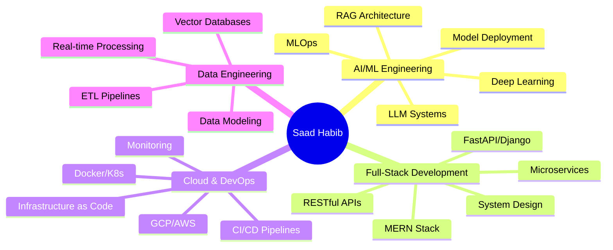

<div align="center">


<p align="center">
  <a href="https://saad-habib.netlify.app/"></a>
  <a href="https://linkedin.com/in/saadhabib01"></a>
  <a href="mailto:saadhabib811@gmail.com"></a>
  <a href="https://docs.google.com/document/d/1OjK69Lwlnx4FW1NoAB8Y0hE2rxHxoLE8/edit?usp=sharing&ouid=106180899309034027760&rtpof=true&sd=true"></a>
</p>


</div>


<div align="center">

## 🚀 『 Elite AI Engineer • Full-Stack Architect • MLOps Specialist 』

</div>


### 💫 About Me

```typescript
const saadHabib = {
    role: "AI/ML Engineer @ Analytiverse",
    location: "Lahore, Pakistan 🇵🇰",
    education: "BS CS @ FAST NUCES",
    
    expertise: {
        ai_ml: ["LLM Systems", "RAG Architecture", "Deep Learning", "NLP"],
        engineering: ["Full-Stack Dev", "Microservices", "System Design"],
        cloud_devops: ["GCP", "Docker", "Kubernetes", "CI/CD"],
        databases: ["MongoDB", "PostgreSQL", "Vector DBs", "Redis"]
    },
    
    currentFocus: ["Production AI Systems", "LLM Evaluation", "Cloud Infrastructure"],
    
    achievements: {
        accuracy: "80%+ LLM validation",
        deployment: "60% faster CI/CD",
        uptime: "99.9% production systems",
        impact: "40% dev cycle acceleration"
    },
    
    motto: "Building intelligent systems that scale"
};
```

<br clear="right"/>


## 🎯 Professional Experience

<table>
<tr>
<td width="50%">

### 🏢 **AI Engineer @ Analytiverse**
*Jun 2025 - Present*

**🔹 Infrastructure & ML Operations**
- Architected GCP-based AI workflow infrastructure
- Managed Docker containerization for ML pipelines
- Automated deployment processes for production systems

**🔹 LLM Systems Development**
- Built Python evaluation frameworks (80%+ accuracy)
- Optimized Agentic AI training pipelines
- Engineered LLM data transformation systems

**🔹 Impact Delivered**
- ⚡ 40% faster AI development cycles
- 🎯 Production-grade evaluation systems
- 🚀 Streamlined MLOps workflows

</td>
<td width="50%">

### 📊 **Key Technologies**

<p align="center">


</p>

### 🎓 **Education**

**FAST NUCES** - BS Computer Science  
*CGPA: 3.16/4.0*

</td>
</tr>
</table>


## 🏆 Featured Projects

<div align="center">

<details open>
<summary><h3>🧠 NeuroAssess - AI Educational Platform</h3></summary>

<table>
<tr>
<td width="60%">

**Revolutionary AI platform for neurodivergent students**

```yaml
Tech Stack:
  Frontend: React.js, Redux, Material-UI
  Backend: Node.js, Express, MongoDB
  AI/ML: TensorFlow, Custom CNN, Hugging Face
  DevOps: Docker, Nginx, Cloud Deployment
  
Key Features:
  - Custom CNN (92% accuracy) for dyslexia detection
  - Role-based access control & JWT auth
  - Microservices architecture
  - Real-time adaptive assessments
  - Containerized deployment
  
Impact:
  ✓ 89% user satisfaction
  ✓ Personalized learning pathways
  ✓ Scalable multi-tenant system
```

</td>
<td width="40%">


**Technologies:**


</td>
</tr>
</table>

</details>

<details>
<summary><h3>🏥 RAG Clinical Intelligence System</h3></summary>

<table>
<tr>
<td width="60%">

**Production-ready diagnostic support system**

```yaml
Tech Stack:
  Framework: LangChain, Streamlit
  Models: Flan-T5, BART Transformers
  Vector DB: Faiss (50K+ records)
  Dataset: MIMIC-IV Clinical Data
  
Architecture:
  - Semantic search with vector embeddings
  - RAG pipeline for context-aware responses
  - Clinical note summarization (85% Rouge-L)
  - Sub-2s query latency
  - Production-optimized retrieval
  
Impact:
  ✓ 70% faster documentation review
  ✓ Maintained diagnostic accuracy
  ✓ Real-time clinical insights
```

</td>
<td width="40%">


**Technologies:**


</td>
</tr>
</table>

</details>

<details>
<summary><h3>🚀 Enterprise CI/CD Pipeline</h3></summary>

<table>
<tr>
<td width="60%">

**Production-grade DevOps infrastructure**

```yaml
Tech Stack:
  CI/CD: Jenkins, GitHub Actions
  Containers: Docker, Kubernetes
  Quality: SonarQube, JUnit
  IaC: Terraform, Ansible
  
Pipeline Stages:
  1. Automated build & compilation
  2. Unit & integration testing
  3. Security scanning & code quality
  4. Docker image optimization (65% size ↓)
  5. K8s deployment with auto-scaling
  6. Health checks & monitoring
  
Impact:
  ✓ 60% faster deployments
  ✓ Zero-downtime releases
  ✓ 85%+ code coverage
```

</td>
<td width="40%">


**Technologies:**


</td>
</tr>
</table>

</details>

<details>
<summary><h3>💬 CVInsight AI Chatbot</h3></summary>

<table>
<tr>
<td width="60%">

**Intelligent resume analysis platform**

```yaml
Tech Stack:
  Frontend: React.js, Tailwind CSS
  Backend: Django REST Framework
  AI: Google Gemini AI API
  Database: PostgreSQL
  Deployment: Vercel + Render
  
Features:
  - Context-aware conversational AI
  - JWT authentication with refresh tokens
  - RESTful API (1000+ concurrent users)
  - Optimized DB queries (sub-100ms)
  - 99.9% uptime SLA
  
Impact:
  ✓ 80% faster candidate screening
  ✓ Intelligent document insights
  ✓ Production-ready scalability
```

</td>
<td width="40%">


**Technologies:**


</td>
</tr>
</table>

</details>

</div>


## 🛠️ Tech Arsenal

<div align="center">

### 🤖 AI/ML & Data Science


### 💻 Full-Stack Development


### 🗄️ Databases


### ☁️ Cloud & DevOps


### 🛠️ Tools & Others


</div>


## 📊 GitHub Statistics

<div align="center">
  
  
</div>

<div align="center">
  
  
</div>


## 🏆 GitHub Trophies

<div align="center">
  
</div>


## 📜 Certifications & Achievements

<div align="center">

| 🏆 Certification | 🎓 Issuer | 📅 Status |
|:---|:---|:---:|
| **Supervised Machine Learning: Regression and Classification** | Stanford University / DeepLearning.AI | ✅ |
| **Advanced Learning Algorithms** | Stanford University / DeepLearning.AI | ✅ |
| **Microsoft Ambassador Challenge: Python Exploration** | Microsoft Learn | ✅ |

</div>


## 💡 Core Competencies Matrix

<div align="center">



</div>


## 🎯 Impact Metrics

<div align="center">

<table>
<tr>
<td align="center" width="25%">

<br />
<b>LLM Accuracy</b>
<br />
<h2>80%+</h2>
Production validation
</td>
<td align="center" width="25%">

<br />
<b>Deployment Speed</b>
<br />
<h2>60%↑</h2>
Faster CI/CD cycles
</td>
<td align="center" width="25%">

<br />
<b>System Uptime</b>
<br />
<h2>99.9%</h2>
Production reliability
</td>
<td align="center" width="25%">

<br />
<b>Dev Acceleration</b>
<br />
<h2>40%↑</h2>
Faster workflows
</td>
</tr>
</table>

</div>


## 🌐 Let's Connect & Collaborate

<div align="center">

<p>
  <a href="https://linkedin.com/in/saadhabib01">
    
  </a>
  <a href="mailto:saadhabib811@gmail.com">
    
  </a>
  <a href="https://saad-habib.netlify.app/">
    
  </a>
  <a href="tel:+923023791666">
    
  </a>
</p>

### 💭 *"Architecting intelligent systems that transform complexity into impact"*

<p>

</p>

**🎯 Open to exciting opportunities in:**
```
AI/ML Engineering  •  Full-Stack Development  •  Cloud Architecture  •  Technical Leadership
```

<p>
  
</p>

</div>

<div align="center">
  
</div>
